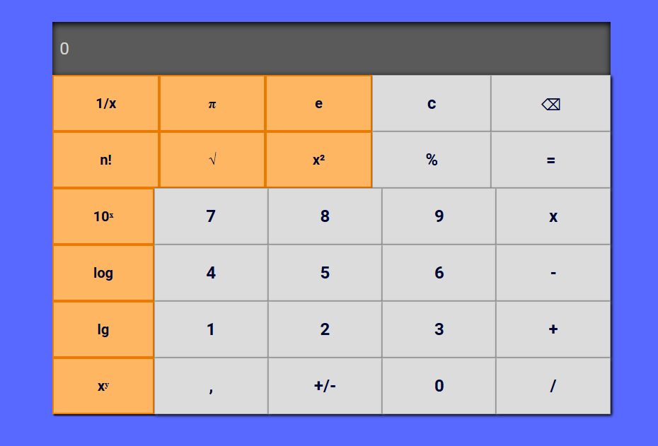
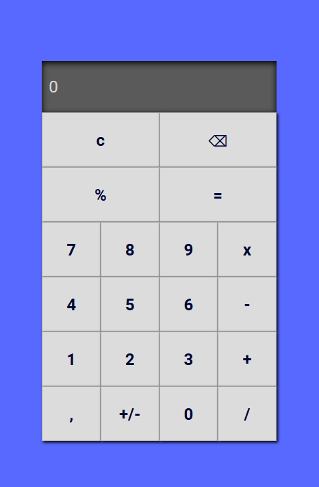

# 🧮 Calculadora com React

Este projeto foi desenvolvido como parte do desafio da **Formação React Developer** na [DIO](https://www.dio.me/). O objetivo foi criar uma calculadora funcional para praticar os conceitos fundamentais do React.

## 🚀 Tecnologias Utilizadas
* **ReactJS**: Biblioteca principal.
* **Styled Components**: Para a estilização dos botões, visor e layout.
* **Hooks (useState)**: Para gerenciamento de estado dos números e operações.

## 🛠️ Funcionalidades da Calculadora Normal
- [x] Soma
- [x] Subtração 
- [x] Multiplicação 
- [x] Divisão 
- [x] Limpar tela (C)
- [x] Porcentagem 
- [x] Apagar um número 


## 🤖 Funcionalidades da Calculadora Científica
- [x] Soma
- [x] Subtração 
- [x] Multiplicação 
- [x] Divisão 
- [x] Limpar tela (C)
- [x] Raiz quadrada 
- [x] Potência
- [x] Um número ao quadrado
- [x] PI 
- [x] Euler
- [x] Porcentagem 
- [x] Logaritmo (log) 
- [x] Logaritmo natural (ln) 
- [x] Fatorial 
- [x] Exponencial de base 10
- [x] Número inverso
- [x] Apagar um número 

## 📸 Fotos
<div align="center">
  
  <p>Modo Desktop</p>
  
  <p>Modo celular</p>
</div>

## 📋 Como executar o projeto
1. Clone este repositório
2. No terminal, execute:
   ```bash
   npm install
   npm start
   ```
 <a href="https://calculadora-react-7zvo.onrender.com/" target="_blank" rel="noopener noreferrer">Teste a calculadora clicando aqui!!!</a>
